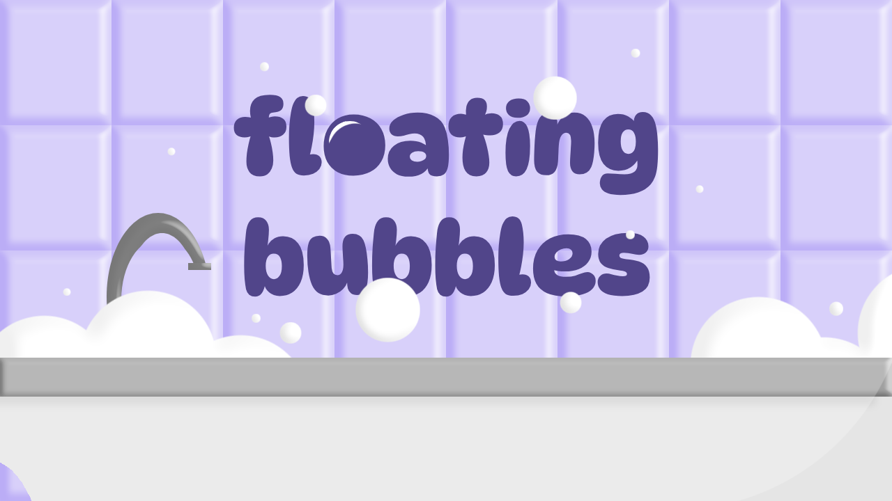

# 🌎 Global-GameJam-2025
A Global Game Jam 2025 foi um evento mundial de programação, realizado de 20 a 26 de janeiro, reunindo desenvolvedores de todo o mundo para criar jogos em apenas 48 horas. O tema deste ano foi "Bubbles" (Bolhas)

---

    

# 🫧 Floating Bubbles
Estoure o máximo de bolhas que puder antes do cronômetro acabar e veja sua pontuação final!
Use as teclas A e D do teclado para mover o canhão e mirar com precisão.
Desafie seus reflexos e divirta-se!

>⚠️ Atenção: Este jogo foi desenvolvido exclusivamente para computadores e não possui responsividade, portanto pode não funcionar corretamente em dispositivos móveis >ou telas pequenas.
